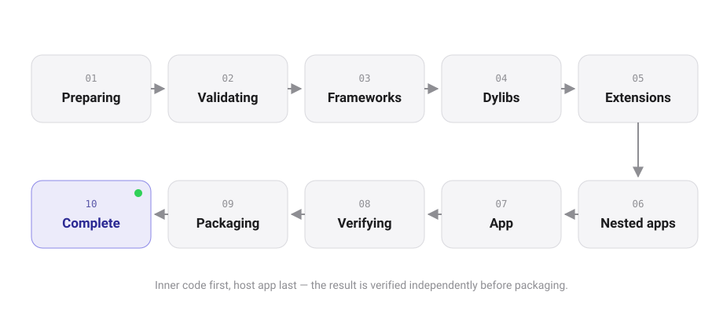

<div align="center">


<br>

<a href="docs/releases/version-strategy.md"></a>
<a href="#requirements"></a>
<a href=".github/workflows/01-build.yml"></a>
<a href="docs/product/WHAT_DOES_NOT_EXIST.md"></a>
<a href="LICENSE"></a>

**Import an IPA, sign it with your own identity, and hand it off for install — entirely on the device, with no server and no desktop helper.**

<sub>One Workspace. Complete Control.</sub>

</div>

---

## Home is a workspace

Open the app and it already knows what you were doing. **Good Morning** · **Continue Last Session** · **Quick Sign** the app you touched last · an **Install Health** score that says which checks ran and which have not · **Recent Apps** · **Certificate** and **Profile** health · the **Download** queue. Cards reorder by what is live now, by time of day, then by what you open most — and the layout policy is a pure, tested function ([`WorkspaceLayoutPolicy`](ZynSign/Domain/Nova/WorkspaceWidget.swift)).

## What it does

| | |
|---|---|
| **Smart Sign** | Nine-stage on-device pipeline: isolated working copy → validation → frameworks, dylibs, extensions and nested apps (inner code first) → host app → independent verification → deterministic packaging. Refuses at the exact stage something is wrong. |
| **Certificate Studio** | `.p12` import into the Keychain (`WhenUnlockedThisDeviceOnly`, non-extractable). Health badges, expiry forecasts, public-metadata JSON export. The private key never leaves the device. |
| **Profiles & Entitlements** | `.mobileprovision` parsing with CMS verification, per-app compatibility, and a read-only Entitlements Studio with diagnostics. |
| **Library & Inspection** | Grid/list library with collections and filters, SHA-256 de-duplication on import, a bounded read-only Bundle Explorer, and a Mach-O / code-signature inspector. |
| **Store & Downloads** | AltSource-compatible catalogs, repository health, resumable background downloads. |
| **Release Feeds** | Follow the releases public repositories publish, hand a package asset to the Download Center, and track one library app per feed. Updates are compared by a bounded version comparator, never by dates. |
| **Tweak Library** | Import, organize, and stage payloads for signing sessions — SHA-256 de-duplicated, bounded, and manifest-recorded beside each signed output. |
| **Revocation Center** | Probes the OCSP and CRL endpoints a certificate publishes and reports how reachable they are right now: `Exposed`, `Partial`, `Shielded`, or `No Endpoints`. |
| **App Protection** | Per-app Lock and a concealed Vault over the system's authentication boundary — an interface guard, stated honestly, not encryption. |
| **Themes & Storage** | Four themes with an accent override and a minimal-density mode, plus a live storage gauge with free-space pressure bands on the Files screen. |
| **Delivery hand-off** | Builds the OTA `manifest.plist`, `itms-services://` link and QR for a signed IPA you host yourself. ZynSign never uploads and never claims an install. |
| **Honest by design** | Typed `ZynSignError`s that say what to do next; readiness checks that report *not performed* instead of a pass; a shipped [anti-roadmap](docs/product/WHAT_DOES_NOT_EXIST.md). |

**Deliberately not included:** in-app installation (`noDeliveryMechanism` on every path), device pairing / JIT / usbmuxd, and any analytics endpoint. Details: [`WHAT_DOES_NOT_EXIST.md`](docs/product/WHAT_DOES_NOT_EXIST.md).

## Requirements

- iOS 17 or later (iPhone and iPad)
- Xcode 16+ to build; Swift 5, SwiftUI, no third-party dependencies
- Distribution is sideload / TestFlight — the app is not on the App Store

## Getting started

```sh
git clone https://github.com/raynmahbub/ZynSign.git
cd ZynSign
open ZynSign.xcodeproj          # select an iOS 17+ simulator or device
# Product → Run (⌘R)  ·  Product → Test (⌘U)
```

Then, in the app: **Import** an `.ipa` → add a **Certificate** (`.p12`) and **Profile** (`.mobileprovision`) → **Library → ⋯ → Sign** → the signed IPA lands in `Documents/Signed/`, ready to share or hand off. Full walk-through: [`docs/development/QuickStart.md`](docs/development/QuickStart.md).

## Architecture

Four layers, composed in one place — `App/CompositionRoot`. Each layer depends on the one below it only; Presentation never touches persistence or crypto directly.

<p align="center">
  <picture>
    <source media="(prefers-color-scheme: dark)" srcset="docs/architecture/diagrams/layers-dark.svg">
    
  </picture>
</p>

| Layer | Holds | May import |
|---|---|---|
| **Presentation** | SwiftUI views, view models, the `DesignSystem` | Application, Domain |
| **Application** | Use cases and ports (`ArtifactIntake`, `LibraryStore`, `IdentityStore`, `SigningPipeline`, …) | Domain |
| **Domain** | Pure value types, policies, parsers — no I/O, no UIKit | Foundation only |
| **Platform** | Port implementations on Apple frameworks (`Security`, `CryptoKit`, `BackgroundTasks`, `ActivityKit`) | Domain |

<p align="center">
  <picture>
    <source media="(prefers-color-scheme: dark)" srcset="docs/architecture/diagrams/signing-pipeline-dark.svg">
    
  </picture>
</p>

Read more: [`architecture.md`](docs/architecture/architecture.md) · [`application-signing-pipeline.md`](docs/architecture/application-signing-pipeline.md) · [`zynsign-design-language.md`](docs/design/zynsign-design-language.md)

<p align="center">
  <picture>
    <source media="(prefers-color-scheme: dark)" srcset="Assets/Brand/Banner/banner-dark.svg">
    
  </picture>
</p>

## Repository layout

```
ZynSign/            App sources — App/ · Application/ · Domain/ · Platform/ · Presentation/ · Resources/
Tests/              ZynSignTests/ (XCTest) · Host/ (Python vectors: Mach-O, CMS, ZIP)
Scripts/            release_train.py · audits · generate_brand_assets.py · generate_hardening_report.py
Assets/Brand/       Logo, app icon (+ alternates), banners, favicon, social, living hero — one master
Assets/Screenshots/ App Store screenshot manifest and template (compose_screenshots.py)
docs/               Architecture, product, design, security, releases, hardening, testing, development
.github/            CI workflows, issue and PR templates
```

## Development

Work lands in small, verified increments; CI builds and tests on an iOS simulator and runs the repository audits on every push.

```sh
python3 Scripts/release_train.py status          # what the current release shows
python3 Scripts/audit_crash_surface.py           # crash-surface inventory vs. baseline
python3 Scripts/audit_accessibility.py --strict  # colours, touch targets, text scaling
python3 Scripts/audit_regression_coverage.py     # regression catalogue names real tests
python3 Scripts/generate_brand_assets.py         # re-render icon + brand assets from the master mark
python3 Scripts/compose_screenshots.py --preview # App Store screenshot template
```

Design and brand: [`docs/design/`](docs/design/README.md) · [brand book](docs/design/brand/README.md) · the passes that need a human run in the app's **Compatibility Lab** (Settings → Compatibility Lab, Debug and internal builds).

Ground rules are in [`CONTRIBUTING.md`](CONTRIBUTING.md); release procedure in [`docs/releases/`](docs/releases/README.md). Current stop on the release train: **`v0.0.1-dev.3`** (marketing `0.0.1`, build `4`).

**Roadmap:** `v2.0.0` deepens the platform; `v3.0.0 “Nova”` makes it a complete iOS signing workspace — Smart Workspace, Nova Assistant (on-device, suggestions only), Install Health Pro, App Studio, Binary Studio, Repository Hub, Trust Center. Plan and architecture mapping: [`docs/product/ROADMAP-v3.0-nova.md`](docs/product/ROADMAP-v3.0-nova.md).

## Security

Signing material is sensitive. Identities are stored non-extractable in the Keychain, diagnostics are redacted, and nothing leaves the sandbox. Report vulnerabilities privately as described in [`SECURITY.md`](SECURITY.md) — never as a public issue.

## License

[MIT](LICENSE). Original software, written from scratch — see the originality clause in [`CONTRIBUTING.md`](CONTRIBUTING.md).
