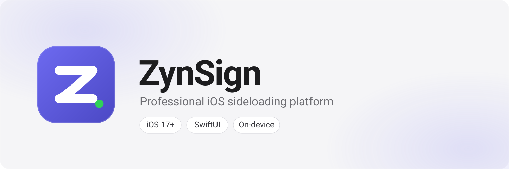
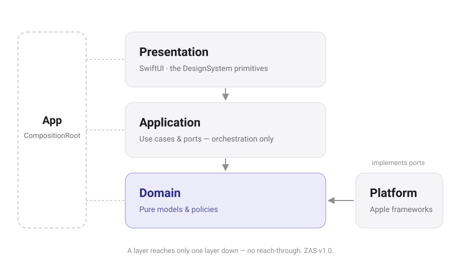

<div align="center">

<picture>
  <source media="prefers-color-scheme: dark" srcset="Assets/Brand/Banner/banner-dark.svg">
  
</picture>

# ZynSign

**On-device signing, made Apple-quality.**

Inspect · Library · Certificate Studio · Smart Sign — inside the sandbox, no desktop helper.

<a href="docs/releases/version-strategy.md"></a>
<a href="LICENSE"></a>
<a href=".github/workflows/ci.yml"></a>
<a href="docs/architecture/architecture.md"></a>
<a href="docs/product/WHAT_DOES_NOT_EXIST.md"></a>

| | | | | |
|:---:|:---:|:---:|:---:|
| **Platform** iOS 17+ | **UI** SwiftUI · ZDL v1.0 | **Stage** `v1.0.0-rc.2` | **Dependencies** none outside Apple frameworks |

</div>

> **1.0.0 Horizon (2026-09-25) — release train**
> The whole app is built: import, inspection, library, **Certificate Studio**, **Smart Sign** (9 stages · independent verification · DER `0x20400` · Live Activity), **Repository Health**, **Download Center**, **Mission Control**, **Installation Delivery Hand-off** (OTA manifest + QR + operator guides), and a **Local Activity Journal** (on-device, never transmitted). It ships **one release at a time** — `0.1.0` shows Files, Import, Library and Bundle Explorer, and each stop on the train switches on more. In-app installation remains a platform fact (`noDeliveryMechanism`); Pairing/JIT/Mux stays **never** (ADR-recorded); off-device analytics stays **off**.

---

## Why ZynSign

Sideloading on iOS is a maze of certificates, entitlements, provisioning profiles, and silently-failing signing steps. ZynSign makes the hard parts feel like a first-party iOS app: import an IPA, sign it, deliver it — with calm, structured feedback and no claim that outruns the evidence behind it.

- **Smart Sign** — a nine-stage on-device pipeline (isolated working copy, inner code first, independent verification) with a Live Activity and a refusal at the exact stage something is wrong.
- **Certificate Studio** — Keychain-first identities (`WhenUnlockedThisDeviceOnly`, non-extractable), health at a glance, **Export public JSON**; the private key never leaves the device.
- **Library & Inspection** — grid/list library with collections, filters, and statistics; a bounded, read-only Bundle Explorer; SHA-256 dedupe built into import.
- **Honest states** — typed `ZynSignError`s that say what to do next, readiness checks that report *not performed* instead of a pass, and a shipped [anti-roadmap](docs/product/WHAT_DOES_NOT_EXIST.md).

Identity: [`docs/product/UNIQUE_VALUE_PROPOSITION.md`](docs/product/UNIQUE_VALUE_PROPOSITION.md)

## Release train

Features are finished and compiled in. `ReleaseTrain.current` in [`ReleaseTrain.swift`](ZynSign/Application/ReleaseTrain.swift) decides which ones a Release build shows. Procedure: [`docs/releases/release-train.md`](docs/releases/release-train.md).

| Release | Switches on |
|---|---|
| `v0.1.0` | Home Dashboard · Import · Library (grid/list, search, sort, favourites) · Bundle Explorer · Certificates · Profiles · Settings |
| `v0.1.0-alpha.1` | Certificate Studio · Advanced Library (collections, smart collections, stackable filters, statistics, bulk and quick actions) |
| `v0.1.0-alpha.2` | Smart Sign (+ Signing Options, Installation screen) · Professional Signing Queue · Intelligent Signing Presets |
| `v0.1.0-alpha.3` | Entitlements Studio · App Store + Repository Health · Download Center · Developer Identity Center |
| `v0.9.0-beta.1` | Mission Control · Delivery Hand-off · Activity Journal — **feature complete** |
| `v0.9.0-beta.2` | Installation Workspace (readiness, Installed Apps Library, confirmed deliveries, history) · Performance Engine |
| `v0.9.0-beta.3…4` | Batch Signing, then fixes |
| **`v1.0.0-rc.1`** | Fixes — plus the **Compatibility Lab** (Debug and internal builds only): validation apparatus, never a user feature |
| **`v1.0.0-rc.2`** ◀ current | Fixes only — the RC 2 polish pass (design system, onboarding, empty states, error recovery, iPad layouts) |
| `v1.0.0-rc.3` → `v1.0.0` | Fixes only, then the Signing Health Score |

```sh
python3 Scripts/release_train.py status     # what's visible now, what's next
python3 Scripts/release_train.py promote    # switch on the next release
```

Debug builds show everything. Add the launch argument `-ZynSignReleaseStage alpha2` to preview a specific release.

## What's shipped

Every row is finished, wired, and gated only by the train. The deep inventory — entry points, limits, and the exact policy behind each surface — lives in [docs/](docs/README.md).

| Area | First ships in | Reads more at |
|---|---|---|
| **Smart Import Hub** — Files picker, share sheet, drag & drop, duplicate resolution, bounded validation | `v0.1.0` | [architecture.md](docs/architecture/architecture.md) |
| **Library & Bundle Explorer** — grid/list, collections, filters, statistics, bulk actions, read-only inspection | `v0.1.0` | [ipa-explorer.md](docs/architecture/ipa-explorer.md) |
| **Certificate Studio** — `.p12` import, Keychain-first storage, health badges, public JSON export | `v0.1.0-alpha.1` | [signing-identities.md](docs/security/signing-identities.md) |
| **Smart Sign** — nine stages, profile-derived entitlements, `DER 0x20400` toggle, Live Activity | `v0.1.0-alpha.2` | [application-signing-pipeline.md](docs/architecture/application-signing-pipeline.md) |
| **Presets & Signing Queue** — one-tap matching, job-based queue with recovery | `v0.1.0-alpha.2` | [signing-queue.md](docs/architecture/signing-queue.md) |
| **Entitlements Studio** — read-only claims, capability cards, Smart Diagnostics | `v0.1.0-alpha.3` | [entitlements-studio.md](docs/architecture/entitlements-studio.md) |
| **Store & Download Center** — AltSource catalog, repository health, resumable background downloads | `v0.1.0-alpha.3` | [store-browser.md](docs/architecture/store-browser.md) |
| **Mission Control & Delivery Hand-off** — Refresh Everything; OTA manifest, install link, QR, operator guides | `v0.9.0-beta.1` | [installation-workspace.md](docs/architecture/installation-workspace.md) |
| **Installation Workspace** — readiness checklists, Installed Apps Library, pending attempts, history | `v0.9.0-beta.2` | [installation-workspace.md](docs/architecture/installation-workspace.md) |
| **Compatibility Lab** — ten on-device validation suites with a `Ready / Incomplete / Blocked` verdict | Debug builds | [compatibility-lab.md](docs/hardening/compatibility-lab.md) |

The `1.0.0` build is **not App Store** — install via sideloading, TestFlight (if enrolled), or direct `Documents/Signed` delivery. See [`CHANGELOG.md`](CHANGELOG.md) and [`docs/releases/`](docs/releases/README.md).

## Architecture

**ZynSign Architecture Standard (ZAS v1.0)** — strict four-layer separation, composed in one place: `Presentation → Application → Domain ← Platform` via `App/CompositionRoot`; `DesignSystem` is the only UI primitive, and a layer reaches one layer down — no reach-through.

<p align="center">
  <picture>
    <source media="prefers-color-scheme: dark" srcset="docs/architecture/diagrams/layers-dark.svg">
    
  </picture>
</p>

- **Domain** is pure, testable value types and policies (no `Foundation` I/O beyond `Data`/`Date`, no `UIKit`).
- **Application** owns ports (`ArtifactIntake`, `LibraryStore`, `IdentityStore`, `SigningPipeline`, …) and orchestrates Domain + Platform.
- **Platform** implements ports with Apple frameworks (`Security`, `CryptoKit`, `UniformTypeIdentifiers`, `BackgroundTasks`/`ActivityKit`).
- **Presentation** composes use cases and renders Domain state — never persistence or crypto directly.

Signing runs nine stages, dependency-first — inner code signed before host, the result verified independently before anything is packaged; a refusal stops the run at its stage. Records live in `Application Support/ZynSignLibrary` (versioned catalog, SHA-256 dedupe, orphan sweep). Nothing leaves the sandbox.

Docs: [`docs/architecture/architecture.md`](docs/architecture/architecture.md) · [`docs/architecture/application-signing-pipeline.md`](docs/architecture/application-signing-pipeline.md) · [`docs/design/zynsign-design-language.md`](docs/design/zynsign-design-language.md)

## Quick start

1. **Import** — `Home → Import IPA` or the Library `+`: pick `.ipa`/`.tipa` from Files. ZynSign stages → validates → fingerprints (SHA-256) → records. Duplicates are recognised; oversize is refused with a typed `ZynSignError`.
2. **Library** — every application as a row or grid card: icon, name, bundle ID, version, import date, signing status. Search, sort, favourites, collections, and a bounded read-only Bundle Explorer per app.
3. **Certificates** — `Certificates → Import`: pick `.p12/.pfx`, enter the password; the identity lands in the Keychain, non-extractable. `Export public JSON` shares metadata only.
4. **Profiles** — `Profiles → Import`: pick `.mobileprovision`. Cards show team, type, devices, expiry, and a compatibility badge; ZynSign suggests the best profile per app and lets you override.
5. **Sign** — `Library → ⋯ → Sign`: identity → profile → entitlements auto-derived from the profile → `Sign Application` → nine live stages → `Documents/Signed/*_signed.ipa`, ready to Share.
6. **Deliver** — `Sign → Deliver…`: host the signed IPA anywhere HTTPS, and ZynSign builds the `manifest.plist`, the `itms-services://…` link, and a QR. ZynSign never uploads and never claims an install.
7. **Store & Maintenance** — add a source under `Settings → Browse`, manage downloads in the Download Center, and let `Home → Refresh Everything` refresh sources, re-read the library, and sweep caches. `Settings → Analytics` shows the on-device journal — clearable, exportable, never transmitted.

Full walk-through with every rule and refusal: [docs/README.md](docs/README.md).

## Documentation

Everything lives under [`docs/`](docs/README.md), browsable from its [index page](docs/README.md): [architecture/](docs/architecture/README.md) · [product/](docs/product/README.md) · [design/](docs/design/README.md) · [security/](docs/security/README.md) · [releases/](docs/releases/README.md) · [hardening/](docs/hardening/README.md) · [testing/](docs/testing/README.md) · [development/](docs/development/README.md).

## Security

Signing-adjacent material is sensitive — read [`SECURITY.md`](SECURITY.md) before touching keys, credentials, profiles, or device data.

- Keys: `SecureIdentityStore` — `WhenUnlockedThisDeviceOnly`, non-extractable, `kSecUseAuthenticationUI = fail`, duplicate SHA-256 rejection.
- Diagnostics are redacted: no key material, profile bodies, file paths, or identifiers in user messages.
- Vulnerabilities are reported privately per [`SECURITY.md`](SECURITY.md) — never as a public issue.

## Release readiness

A release candidate is judged in one place: the **Compatibility Lab** (`Settings → Compatibility Lab`, Debug and internal builds only). Ten suites run against the running app and the device and reduce to a verdict — `Ready`, `Incomplete`, or `Blocked`. Its rules: a check that did not run is an **open question**, not a pass, and it outranks a pass whenever results roll up; every check answers *what happened, what was verified, what to do next*; results only a human can produce are reported as not run and named, never filled in.

Full pack: [`docs/hardening/README.md`](docs/hardening/README.md). Release process: [`docs/releases/README.md`](docs/releases/README.md).

## Development

Built in small, explicitly scoped increments: task-driven, one branch per task, no speculative code, every change verified. Ground rules: [`CONTRIBUTING.md`](CONTRIBUTING.md).

Current stop: `v1.0.0-rc.2` on the release train (market `1.0.0`, build `5`). Next: `v1.0.0-rc.3` via `python3 Scripts/release_train.py promote`.

```sh
git clone https://github.com/raynmahbub/ZynSign.git
cd ZynSign
open ZynSign.xcodeproj   # Xcode 16+, iOS 17+ simulator
# Product → Test (⌘U) — domain + import + library + certs + provisioning + MachO + signing metadata

# RC audits, without Xcode:
python3 Scripts/audit_crash_surface.py        # the crash-surface inventory
python3 Scripts/audit_accessibility.py        # colours, touch targets, text scaling
python3 Scripts/audit_regression_coverage.py  # the regression catalogue names real tests
python3 Scripts/generate_hardening_report.py  # the browsable hardening page
# Host vectors: Tests/Host/external_validation.py run  (macOS codesign/otool/openssl, non-gating)
```

CI builds and tests on an iPhone simulator on every push, runs repository hygiene, host vectors, and the RC audits: [`.github/workflows/ci.yml`](.github/workflows/ci.yml), described in [`docs/development/continuous-integration.md`](docs/development/continuous-integration.md).

## Honest limitations

No app claims to install arbitrary IPAs on stock iOS. ZynSign is explicit:

- **Installation** — `supports: false` on every path (`noDeliveryMechanism` first). No MDM/OTA/host flow is composed; signed output is `Documents/Signed` for you to deliver.
- **Pairing / JIT / Mux / OpenSSL** — never composed (would need `lockdown`/`MobileDevice` private entitlements). Keeps the binary reviewable.
- **Analytics** — none. No Kit, no SDK, no endpoint, no identifier.

If a screen claims one of those as working, the screen is wrong — file an issue with the exact `ZynSignError` code. Full anti-roadmap: [`docs/product/WHAT_DOES_NOT_EXIST.md`](docs/product/WHAT_DOES_NOT_EXIST.md) · Installability: [`docs/architecture/installation-compatibility.md`](docs/architecture/installation-compatibility.md)

## Repository layout

```
ZynSign/                   App sources
  App/                     CompositionRoot, environment
  Application/             Use cases & ports
  Domain/                  Pure models & policies
  Platform/                Apple framework implementations
  Presentation/            SwiftUI · DesignSystem · six-tab shell
  Resources/               Asset catalog (app icon)
Tests/
  ZynSignTests/            Unit + fixture tests
  Host/                    external_validation.py, verify_*.py
Scripts/                   release_train.py, audits, generators
docs/                      Documentation hub — see docs/README.md
Assets/                    Brand system, screenshots, media — see Assets/README.md
.github/                   Workflows, issue & PR templates
```

## License

[MIT](LICENSE) — original software, written from scratch. See the [`CONTRIBUTING.md`](CONTRIBUTING.md) originality clause and [`docs/product/UNIQUE_VALUE_PROPOSITION.md`](docs/product/UNIQUE_VALUE_PROPOSITION.md).
